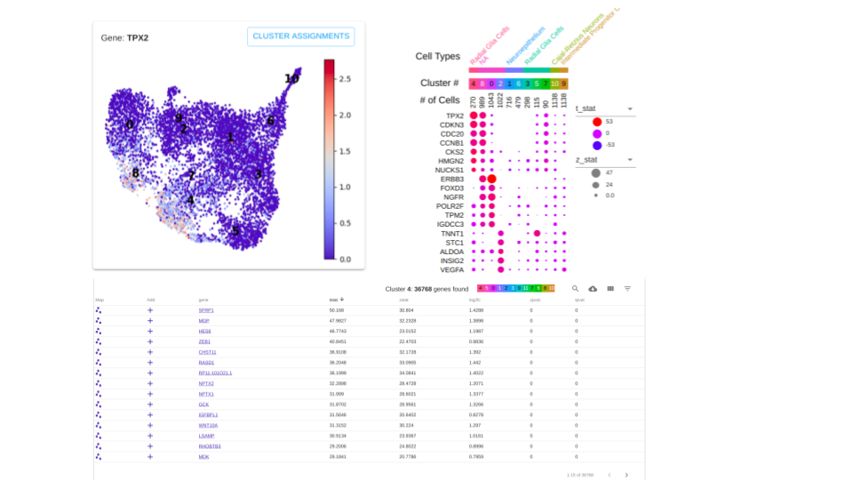

# ctwR
Create a Cell Type Worksheet from a Seurat Object in R.

* [What is a Cell Type Worksheet?](#what)
* [Minimal amount of information to create a CTW](#format)
* [Vignette for composing a Cell Type Worksheet](#vig)

## <a name="what"></a> What is a Cell Type Worksheet?
A Cell Type Worksheet is an application designed to ease the burden of manual cell type annotation from single cell
mRNA sequencing experiments. It lets you explore the specificity of markers across clusters and label the clusters
with a cell type annotation.

The web application provides three interactive components for this goal:

1. An editable dot plot visualizing marker specificity and cell type annotation across all clusters.
2. A scatter plot visualizing gene expression across all cells.
3. A table of gene metric rankings per cluster.

Here's a rough visual of the layout of the application, the gene metrics are explored via the table at the bottom.


This readme servers as instructions for how to make Cell Type Worksheet with the Seurat Package.
## <a name="format"></a> CTW format
The Cell Type Worksheet format is a compressed directory with a minimum of 4 tab delimited files:

1. Expression Matrix

|       gene       | AAACCTGCAAACTGTC | AAACCTGCAAGGGTCA | AAACCTGCAAGTAATG | ... |
|:----------------:|:----------------:|------------------|------------------|-----|
| TP53 |         0        | 0                | 0                | ... |
| ALKBH6 |         1        | 0                | 1                | ... |
| MYLH1 |         2        | 1                | 3                | ... |
| TMNT2 |         0        | 4.5              | 0                | ... |
| TTN |        3.4       | 0                | 2                | ... |


     + File name is "exp.tsv"
     + Gene names are rows, Cell ids are columns
     + Can be filtered down to genes of interest
     
2. Cell to Cluster Assignment

|      cellids     | cluster |
|:----------------:|:-------:|
| AAACCTGCAAACTGTC |    1    |
| AAACCTGCAAGGGTCA |    1    |
| AAACCTGCAAGTAATG |    2    |
| AAACCTGCACATAACC |    3    |
| AAACCTGCAGACGCCT |    3    |

     + File name is "clustering.tsv"
     + First column is cell ids
     + Second columns is cluster assignment
     + First line is a header.
     
3. XY Coordinates

|      cellids     |  x  | y   |
|:----------------:|:---:|-----|
| AAACCTGCAAACTGTC | 1.1 | 0.4 |
| AAACCTGCAAGGGTCA | 1.5 | 0.8 |
| AAACCTGCAAGTAATG | 2.2 | 3.2 |
| AAACCTGCACATAACC | 3.3 | 4.5 |
| AAACCTGCAGACGCCT | 3.4 | 4.7 |

     + File name is "xys.tsv"
     + First column is cell ids
     + Second Column is x coordinates
     + Third Column is y coordinates
     + First line is a header.
     
4. Gene Metrics Per Cluster

|  gene  | t-statistic | pct.exp | avg.exp.scaled | ... | cluster |
|:------:|:-----------:|---------|----------------|-----|---------|
|  TP53  |     3.4     | 46      | 2.2            | ... | 1       |
| ALKBH6 |    -0.86    | 0       | -0.1           | ... | 1       |
|  TP53  |     -0.1    | 15.2    | -0.01          | ... | 2       |
| ALKBH6 | 1.2         | 35      | 0.95           | ... | 2       |
|  TP53  |     3.8     | 88.2    | 2.5            | ... | 3       |
| ALKBH6 |     3.4     | 100     | 2.5            | ... | 3       |

     + File name is "markers.tsv"
     + First column is "gene"
     + Last columns is "cluster"
     + At least 2 columns inbetween "gene" and "cluster", e.g. "avg.exp" and "pct.exp"
     
     
## <a name="vig"></a> Vignette
For this example we will assume you have already followed the Seurat pipeline down past the
dimensionality reduction stage and the clustering stage.

The first step of the process is to make a worksheet directory on your machine. Your name for the
worksheet is encoded in the directory name.

```
mkdir /path/to/worksheet-name
```
You'll be writing necessary data to the worksheet directory.

The next step is to determine what genes you would like to explore in the
Cell Type Worksheet. We suggest using Seurat's FindAllMarkers function. In an R session:
```R
library("Seurat")

# If working with a lot of cells consider a multiprocess strategy for
# calculating the differentials.
#library("future")
#options(future.globals.maxSize = 10 * 1024 ^ 3)
#plan(strategy = "multiprocess", workers = availableCores())

# Read in your seurat object
sboj <- readRDS("/path/to/your/seuratv3.rds")

# This returns makers based on significance of the differential
markers <- FindAllMarkers(sobj, only.pos = TRUE, min.pct = -Inf, logfc.threshold = -Inf, return.thresh = Inf)
```

The next step is to gather the values that will fill your dotplot. The easiest way
to do this is to use Seurat's DotPlot function.

```R
dotplot = DotPlot(sobj, 
     features = markers, cols.use = c("blue","red", "green"),
     x.lab.rot = T, plot.legend = F,
     dot.scale = 8, do.return = T
     )

markers = dotplot$data

# Rename the columns of the table to the correct format.
colnames(markers) <- c("avg.exp", "pct.exp", "gene", "cluster", "avg.exp.scaled")
# Reorder the columns of the table to the correct format.
markers <- markers[c("gene", "avg.exp.scaled", "pct.exp", "avg.exp", "cluster")]
```

Now we have all the data we need inside the seurat object and in the markers dataframe.

Our next step is to write them all to our worksheet directory.

```R
# Wrapper to access UMAP xy coordinates from Seurat
getUMAP <- function(object){
  object@reductions$umap@cell.embeddings[,1:2]
}
# Write xy coordinates to file.
write.table(getUMAP(sobj),"/path/to/worksheet-name/xys.tsv", sep="\t")

# Write cell to cluster assignment to file.
write.table(Idents(sobj),"/path/to/worksheet-name/clustering.tsv", sep="\t")

# Accessing expression matrix.
exp = GetAssayData(object = fetalCombined, slot = "data")
# Filter to markers found.
exp = exp[rownames(exp) %in% as.character(markers),]
# Write the expression matrix to file.
exp <- data.frame(exp)
write.table(exp, "/path/to/worksheet-name/exp.tsv", sep="\t", row.names=T)
```
Now it's time to tar and gzip your worksheet directory.
```
tar -cvzf worksheet-name.ctw.tgz /path/to/worksheet-name
```
Your worksheet-name.ctw.tgz file is ready to upload to the Cell Type Workbench.

To upload this worksheet data to the server, go to http://https://cellatlas.ucsc.edu/cell-type, 
log in, open the menu in the upper left and select "Upload Data".

If you do not have an account yet, you may create one by clicking on "Sign in" in the upper 
right of the screen. Then click "Register".
